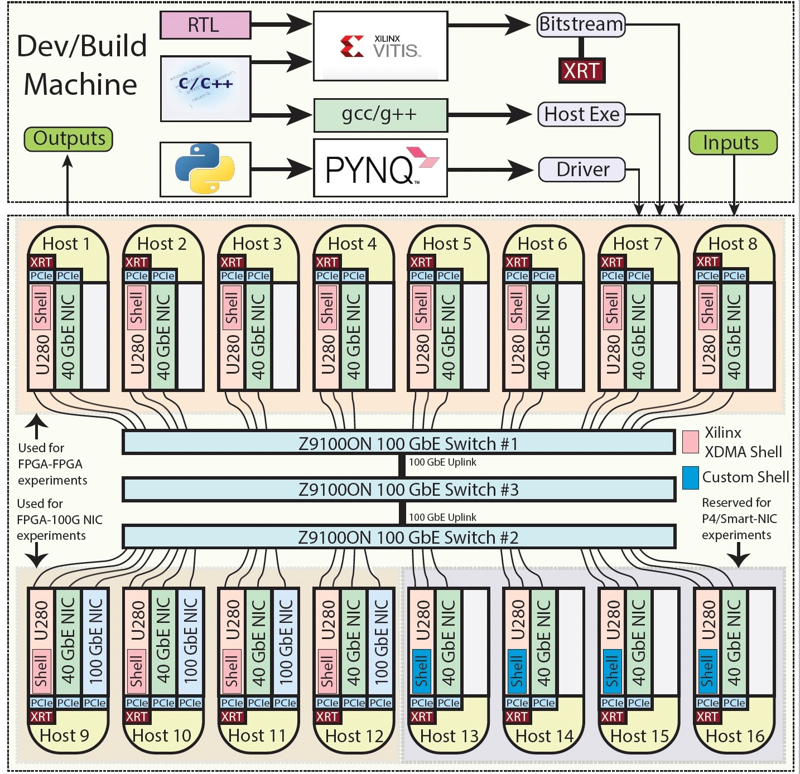

# Getting Started

The Open Cloud Testbed (OCT) workflow consists of two parts.

**1. Development:** 
OCT development tools are hosted on a virtual machine (VM) in New England Research Cloud (NERC). Users can remotely log into this VM and build FPGA bitstreams/host executables using the tools installed on the VM. Alternatively, users may use their own build machine if they prefer to do so. In this case, they will have to install Xilinx Vitis and runtime tools on their machine.

**2. Deployment:**
After creating the bitstreams/host executables, users will use CloudLab for targeting. There are sixteen Alveo U280s in CloudLab Massachusetts cluster which are PCIe connected to sixteen host machines. These U280s are connected to 100 GbE data center switches using QSFP28 passive DAC cables. Four of the sixteen nodes have 100 GbE NICs installed. Another four have been allocated for a P4-enabled SmartNIC testbed.

## Stand-alone FPGA experiment workflow

1. Log into your account on the NERC VM to develop applications (or use your own build machine). Follow [these instructions] if you decided to use the VM on NERC(https://github.com/OCT-FPGA/OCT-Tutorials/blob/master/nercsetup/nerc-vm-guide.md).
2. Build a bitstream and a host executable.
3. Set up a CloudLab node. Follow [these instructions](https://github.com/OCT-FPGA/OCT-Tutorials/blob/master/cloudlab-setup/README.md). 
4. Copy the bitstream and executable to the CloudLab node.
5. Run the application.

An example is given [here](https://github.com/OCT-FPGA/Vitis-Tutorials-U280/tree/moc-cloudlab/VitisAccelHelloWorld).

## Network-attached FPGA experiment workflow

The workflow is the same as stand-alone workflow except that you select two or more FPGAs when setting up the CloudLab experiment.

An example is given [here](https://github.com/OCT-FPGA/udp-network-demo).
