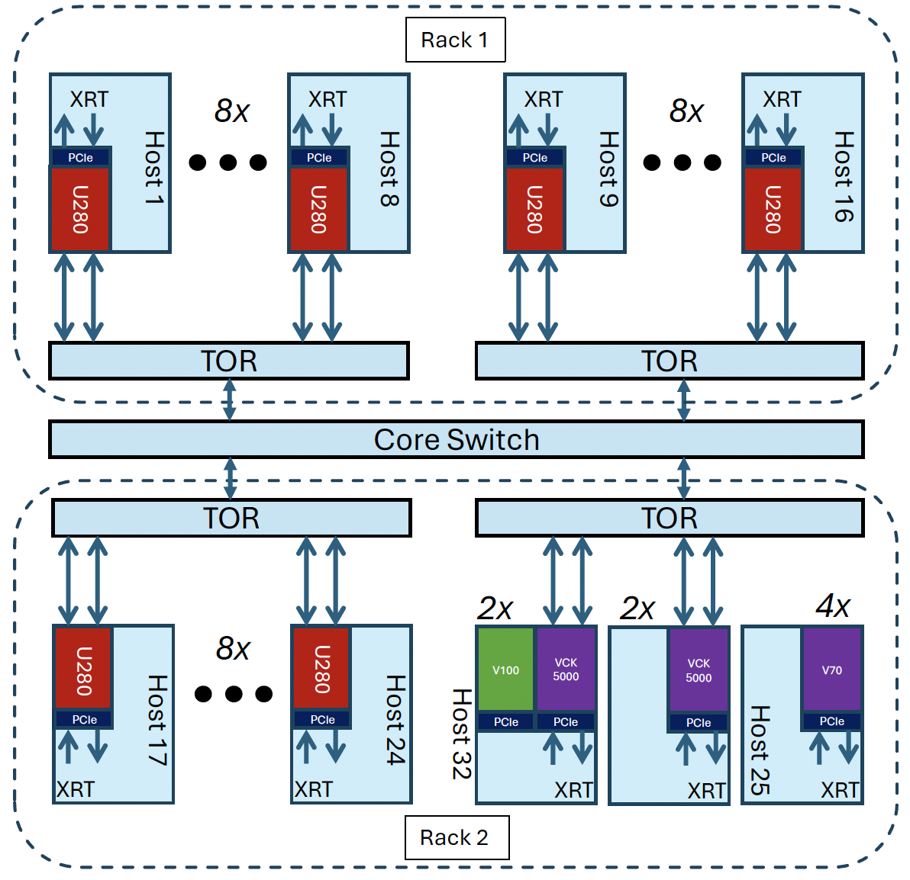

# Getting Started

The Open Cloud Testbed (OCT) workflow consists of two parts.

**1. Development:** 
OCT development tools are hosted on a virtual machine (VM) in New England Research Cloud (NERC). Users can remotely log into this VM and build FPGA bitstreams/host executables using the tools installed on the VM. Alternatively, users may use their own build machine if they prefer to do so. In this case, they will have to install Xilinx Vitis and runtime tools on their machine.

If you’d like to use the build machines we provide, please follow [these instructions](https://github.com/OCT-FPGA/OCT-Tutorials/blob/master/nercsetup/nerc-vm-guide.md#nerc-vm-user-guide).

**2. Deployment:**
After creating the bitstreams/host executables, users will use CloudLab for targeting. OCT currently consists of 24 AMD Alveo U280s, 4 AMD VCK5000s, 4 AMD V70s, and 2 NVIDIA V100 GPUs. The U280s and VCK5000s are connected to 100 GbE data center switches using QSFP28 passive DAC cables. 



We have created the CloudLab profiles ```oct-u280```, ```oct-vck5000```, and ```oct-v70``` to help users select nodes with the specific resources they need.

## U280 Tutorials

[Vector Addition](https://github.com/OCT-FPGA/Vitis-Tutorials-U280/tree/2022.2/VitisAccelHelloWorld)

[UDP Network Demo](https://github.com/OCT-FPGA/udp-network-demo)

## Versal Tutorials (VCK5000 and V70)

[Getting Started with V70s](https://github.com/OCT-FPGA/versal-tutorials/blob/main/v70-getting-started.md)

[Getting started with VCK5000s](https://github.com/OCT-FPGA/versal-tutorials/blob/main/vck5000-getting-started.md)
