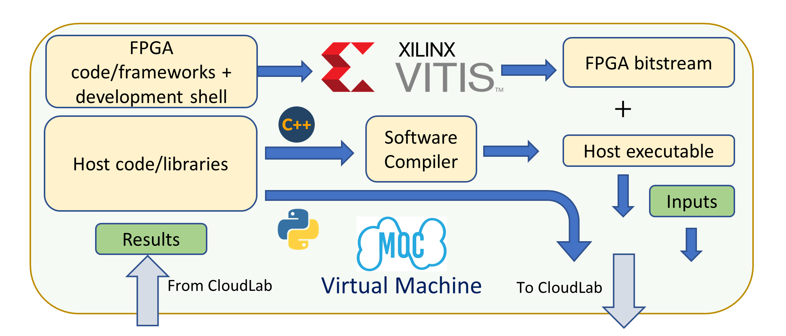
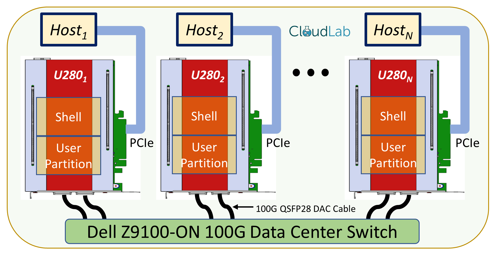

# Getting Started

The Open Cloud Testbed (OCT) workflow consists of two parts.

**1. Development:** 
OCT development tools are hosted in Massachusetts Open Cloud (MOC). Users can sign up for an MOC account and build FPGA bitstreams/host executables using the tools.

**2. Deployment:**
After creating the bitstreams/host executables, users will use CloudLab for targeting. There are eight Alveo U280s in CloudLab Massachusetts cluster which are PCIe connected to eight host machines. The U280s are connected to a 100 GbE data center switch using 100G QSFP28 passive DAC cables. 

## Stand-alone FPGA experiment workflow

1. Create a VM in MOC to develop applications. Follow [these instructions](https://github.com/OCT-FPGA/OCT-Tutorials/blob/moc-cloudlab/mocsetup/account-setup-and-configuration.md).
2. Build a bitstream and a host executable.
3. Set up a CloudLab node. Follow [these instructions](https://github.com/OCT-FPGA/OCT-Tutorials/blob/moc-cloudlab/cloudlab-setup/README.md). 
4. Copy the bitstream and executable to the CloudLab node.
5. Run the application.

An example is given [here](https://github.com/OCT-FPGA/Vitis-Tutorials-U280/blob/moc-cloudlab/Getting_Started/vitis-getting-started-moc.md).

## Network-attached FPGA experiment workflow

Follow the stand-alone workflow. The only difference is, select two or more FPGA nodes when you parameterize the experiment in Step 3. 

An example is given [here](https://github.com/OCT-FPGA/udp-network-demo).
