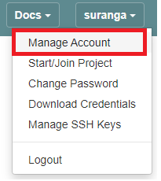
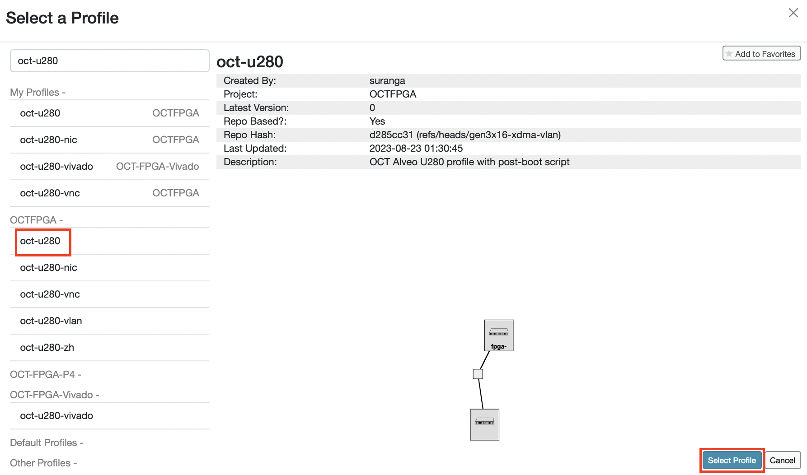
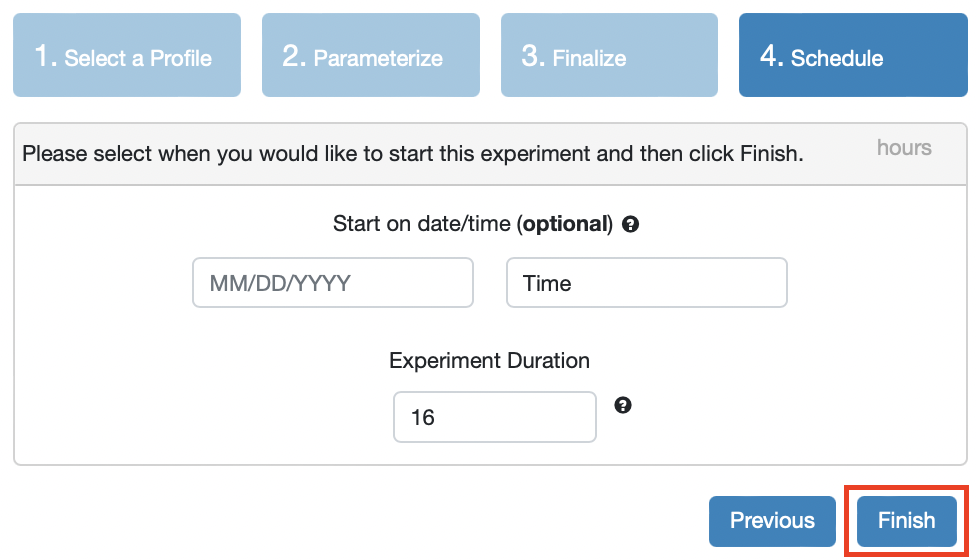

# Experimental setup for the OCT U280 FPGAs

The CloudLab Umass cluster has 8 nodes, each of which hosts an Alveo U280 FPGA accelerator card. You need to create a CloudLab experiment to access any of these FPGAs. An experiment will give you access to a bare-metal node. By using an experiment profile, you can configure this node so that it will have the tools required to access the FPGA.  If you are not familiar with the CloudLab experiment workflow, it is strongly recommended to refer to [The CloudLab Manual](http://docs.cloudlab.us/) before getting started.

## 1. Set up a Cloudlab project

If you already have a CloudLab account, skip to Section 1.2.

### 1.1 New users

Go to [cloudlab.us](https://cloudlab.us) and click Request an Account.


Enter your details. You need to provide an SSH public key. Make sure you have access to the corresponding private key which you will need to log in to the Cloudlab server. For specific instructions on how to create a key-pair and access your CloudLab node using either MOC or your home/work computer, please refer to [this tutorial](https://github.com/OCT-FPGA/OCT-Tutorials/blob/master/managing-keys/setup-keys.md). Select Join Existing Project, enter ```OCTFPGA``` and submit the request. Note: P4/SmartNIC users planning to use Vivado custom workflow for programming the FPGAs, should join the project ```OCT-FPGA-P4``` instead.


The account approval process could take a couple of days. Once you got the approval, go to step 2. 

### 1.2. Existing users

If you already have a Cloudlab account, first log into your account and select Start/Join Project. 


Enter the project name ```OCTFPGA``` and click Submit Request.


As an existing user, you should already have a key-pair which you need to remotely access a CloudLab node. If you need to upload a different public key, you may do so by going to "your user name" &#8594; Manage SSH Keys, 
  

  
and entering your public key. Steps on how to create an SSH key-pair can be found [here](https://github.com/OCT-FPGA/oct-tutorials/blob/main/managing-keys/setup-keys.md).


## 2. Start an experiment

Note: Before you start an experiment, make sure that your default shell is set to bash. To do this, click on your name in the upper right, select Manage Account, and then set the Default Shell to bash and click Save.



Now you need to select or create an experiment profile. For FPGA experiments, we have created the profile ```oct-u280``` for your reference. This profile can be used to boot up either an Ubuntu or CentOS image and install run-time tools automatically by running a post-boot script in the background. It is also possible to create your own profiles. To learn how to do this, please refer to [The Cloudlab Manual](http://docs.cloudlab.us/).

Select Experiments &#8594; Start Experiment.


Click Change Profile and select the profile ```oct-u280```.



Click Next.


You can customize the experiment by parameterizing the setup. Enter the name of the required node, a tool version, and the OS from the list of options. 


If you are involved in multiple CloudLab projects, you will be required to choose the OCTFPGA project in Step 3. However, if you are solely a member of the OCTFPGA project, you might not have the option to select it here. Optionally, enter a name for the experiment and click Next.


You can set the experiment duration now, or click Finish. The default is 16 hours. It is important to keep in mind that after 16 hours, everything you have done in this experiment will be wiped out from your node. Therefore, ensure that you complete the experiment by then and save the experiment outputs in a persistent storage.



Now, CloudLab will start provisioning cloud resources based on the parameters you specified. 


The node will start to boot up.


After boot up, the node will run the startup script which will download and install run time tools required to communicate with the FPGA. The node icon will show that the startup script is ```Running```.


After running the script, the icon status will change to ```Finished```. Your experiment is ready now.


Switch to the tab List View. Now you will see the SSH command that you can use to conect to this server. Use any SSH client to connect to the node. Alternatively you can select the Shell option in the UI which will open a shell.


You can run your experiment now.


## Useful links

[The CloudLab Manual](http://docs.cloudlab.us/)
