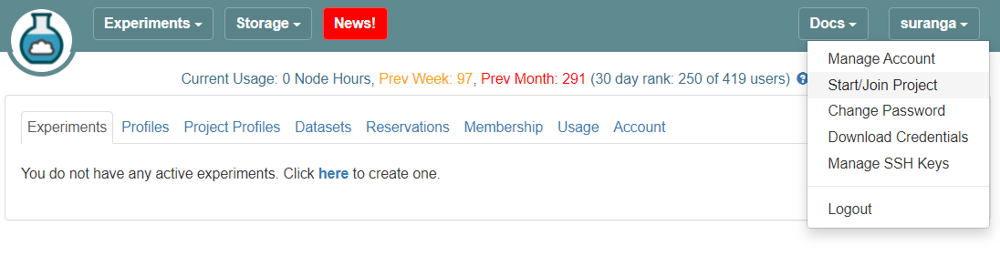
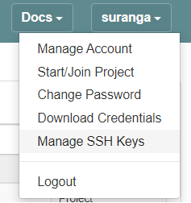

# Requesting Access to OCT

If you are not familiar with the CloudLab experiment workflow, it is strongly recommended to refer to [The CloudLab Manual](http://docs.cloudlab.us/) before getting started.

## 1. Set up a CloudLab project

### 1.1 New users

Go to [cloudlab.us](https://cloudlab.us) and click Request an Account.


Enter your details. You need to provide an SSH public key. Make sure you have access to the corresponding private key which you will need to log in to the Cloudlab server. For specific instructions on how to create a key-pair and access your CloudLab node using either MOC or your home/work computer, please refer to [this tutorial](https://github.com/OCT-FPGA/OCT-Tutorials/blob/master/managing-keys/setup-keys.md). Select Join Existing Project, enter ```OCTFPGA``` and submit the request.


### 1.2. Existing users

Log into your account and select Start/Join Project.



Enter the project name ```OCTFPGA``` and click Submit Request.


As an existing user, you should already have a key-pair which you need to remotely access a CloudLab node. If you need to upload a different public key, you may do so by going to "your user name" → Manage SSH Keys,



and entering your public key. Steps on how to create an SSH key-pair can be found [here](/managing-keys/setup-keys.md).


You’ll receive an email notification once your account request has been approved.
