# Allocating a Build Machine in OCT

This guide explains how to allocate a build machine in OCT. These build machines are preconfigured with **Xilinx Vitis** and **Vivado**, so you can compile and build FPGA projects without needing to install the tools yourself.  

Use the profile `oct-build` to spin up a build machine.
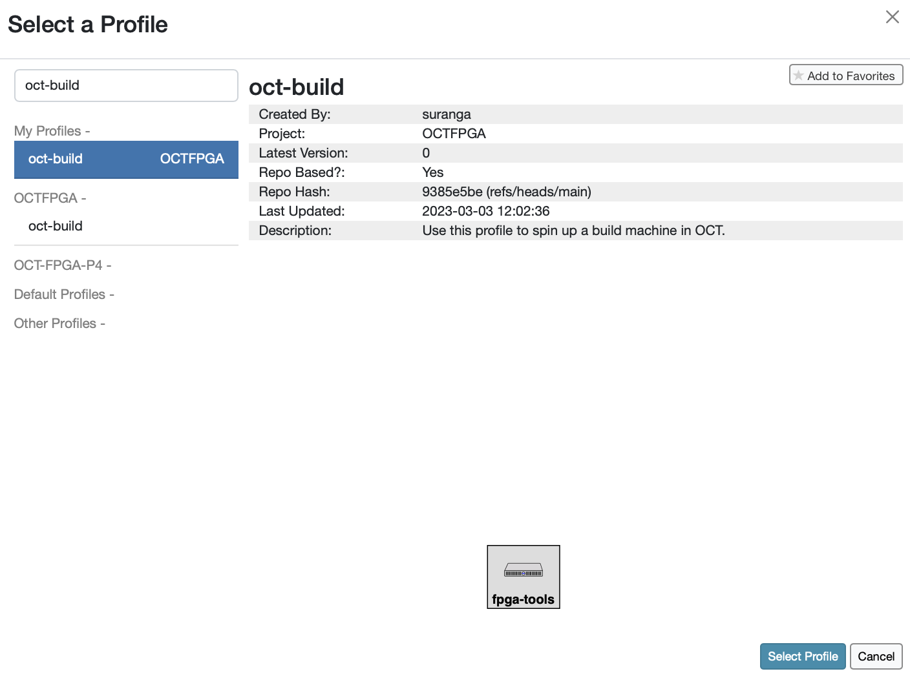
Click Next.
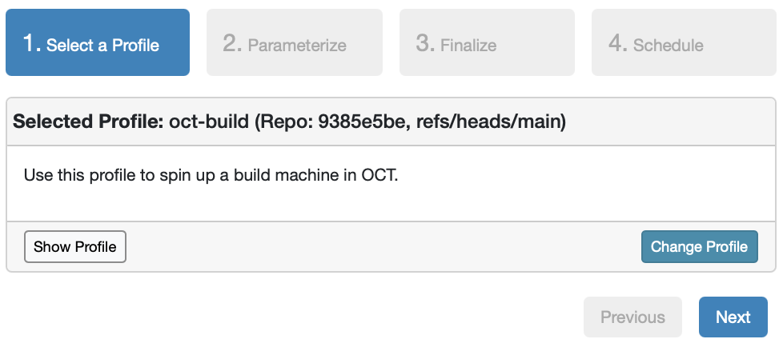

For the VM, choose the RAM, number of vCPUs, and the tool version. If you want to use VNC, enable the remote desktop option, and click Next.
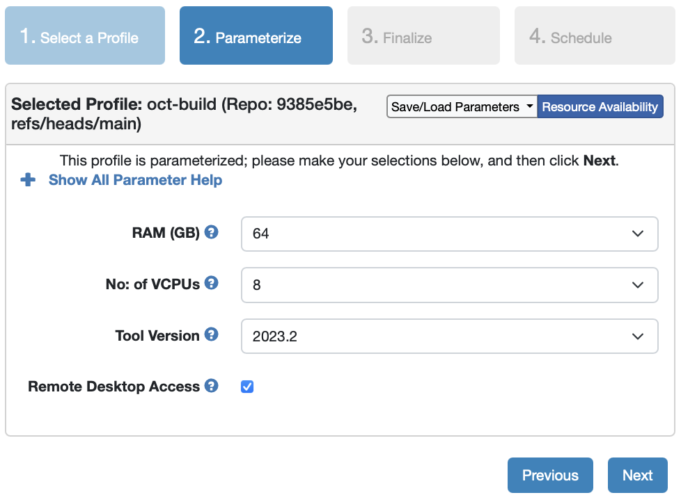

Enter a name for the experiment (optional), then click Next.
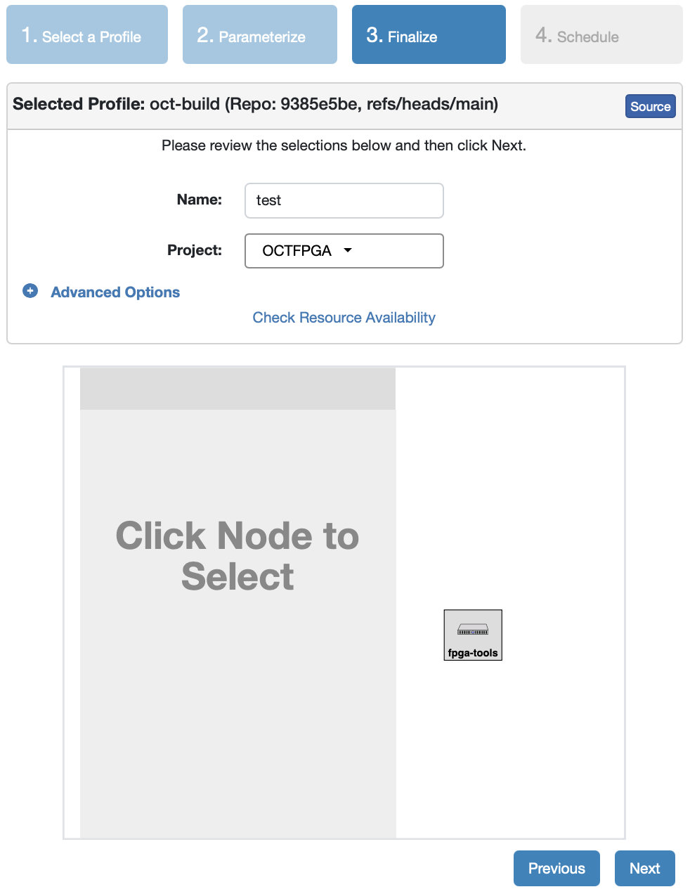

When you click Finish, the CloudLab experiment will start.
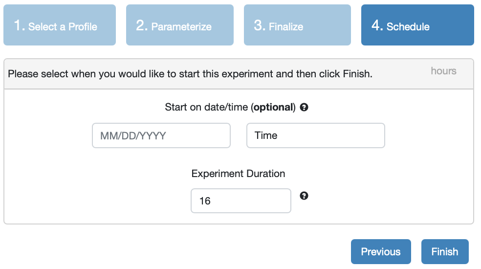

CloudLab starts provisioning your experiment. This means that CloudLab is reserving the hardware you requested, loading the correct images, and applying your chosen settings (like RAM, vCPUs, and so on).
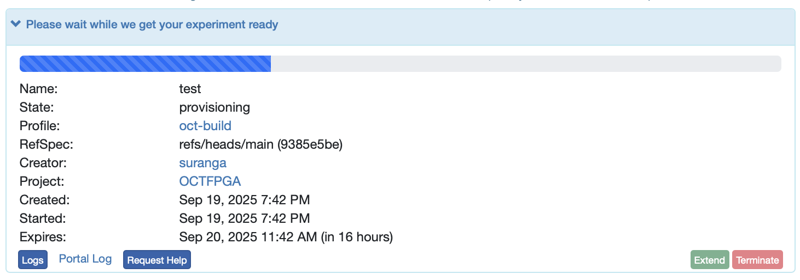

After that, the node will boot up.
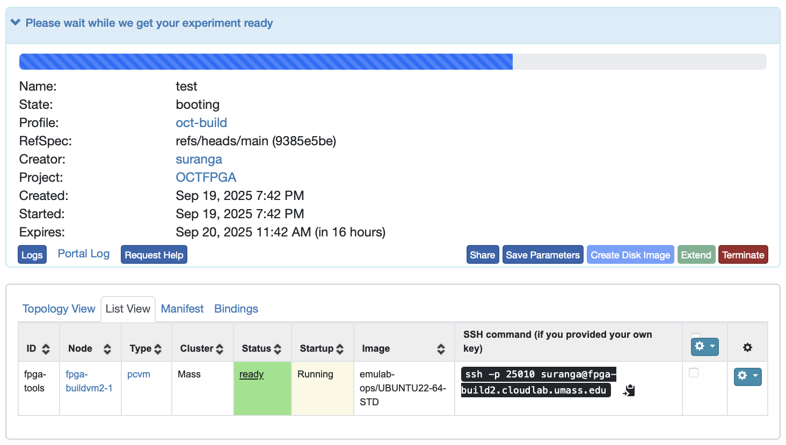


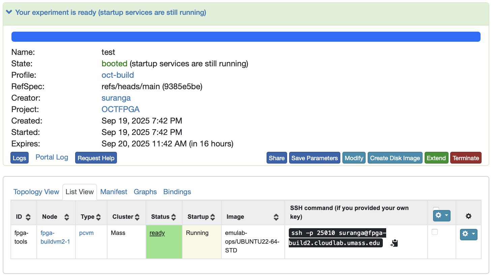

After the node finishes booting, the startup services will launch. This installs all the tools you need, including Xilinx Runtime and others required to build bitstreams, as well as any components needed for VNC access if you selected the remote desktop option when setting up the experiment. Do not log into the node while the startup services are still running, as the setup is not complete.
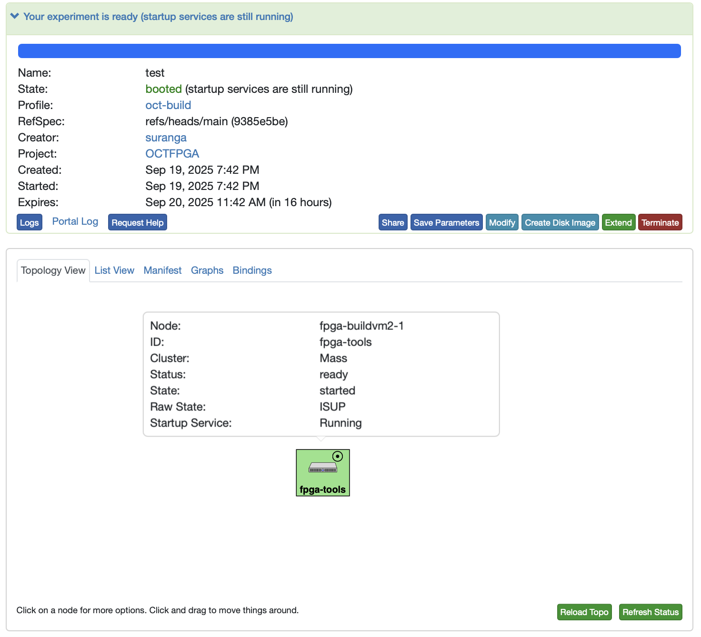

Once the startup services are complete, a checkmark will appear on the node icon. After that, you can log into the node. You’ll also see the SSH command you need to use to access it.
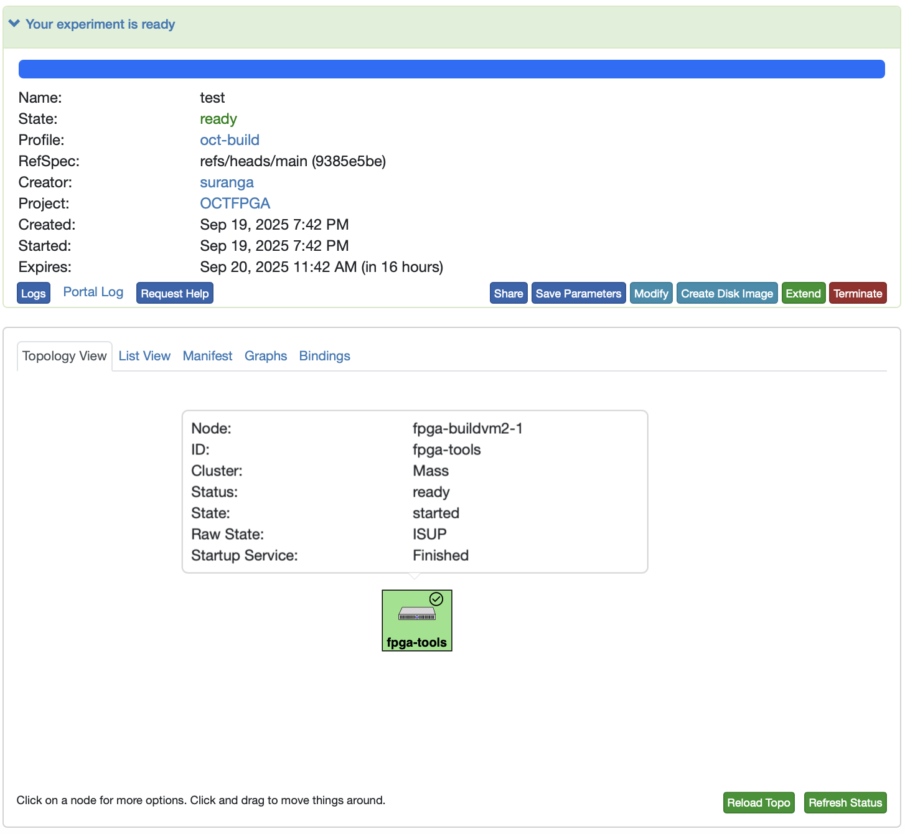

Add this information to your `~/.ssh/config` file.

```
Host oct-build
    HostName fpga-build2.cloudlab.umass.edu
    User <username>
    Port <port>
    IdentityFile <private key>
    LocalForward 5901 localhost:5901
```

Replace <username>, <port>, and <private key> with your own details. This setup also forwards port 5901 so you can use VNC if needed.

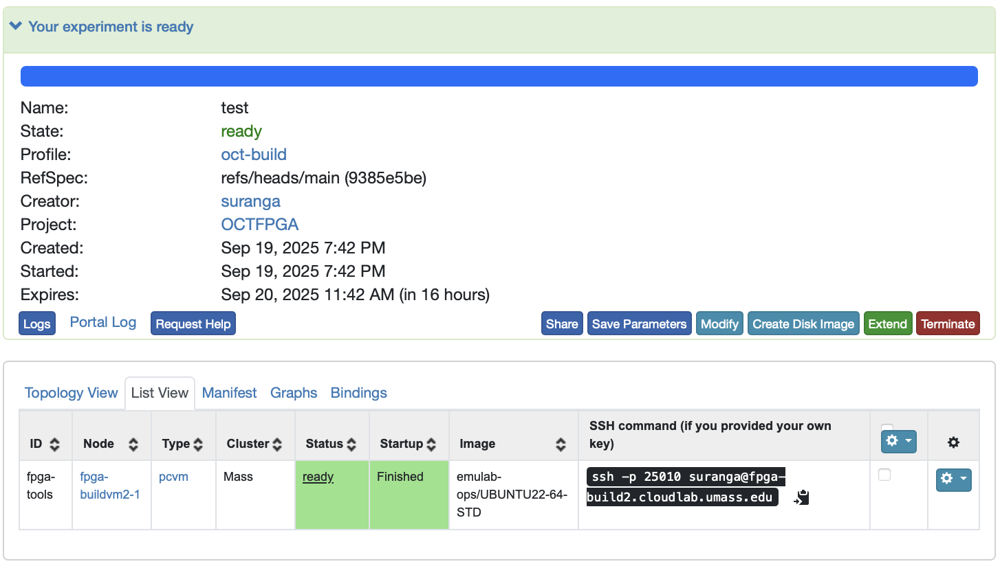
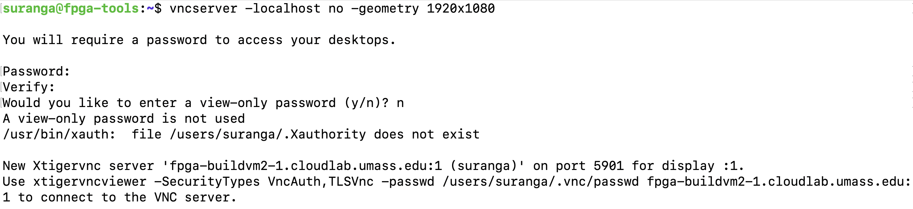
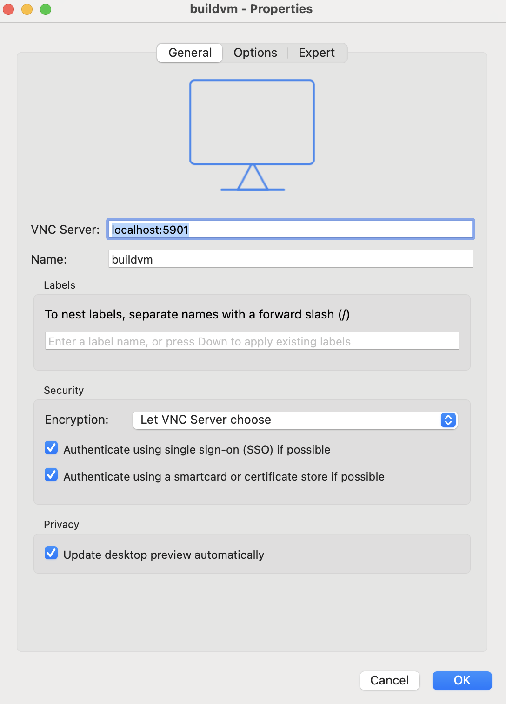
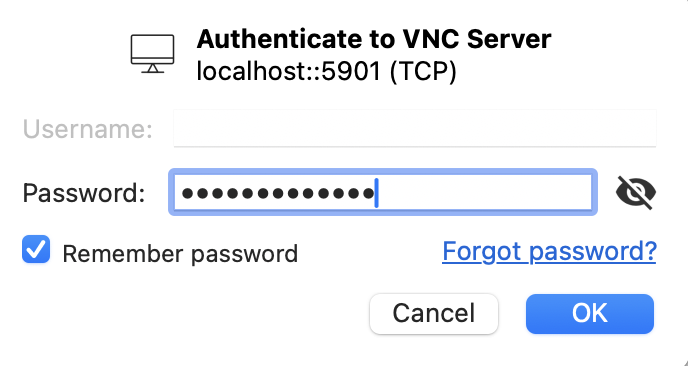
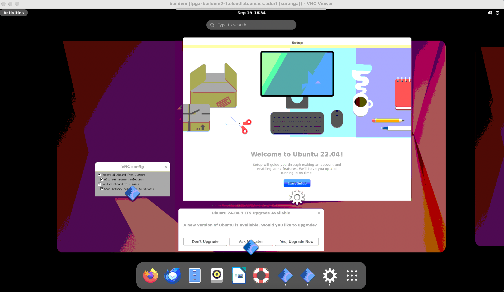
