# Getting Started with FPGAs in OCT

Note: Before you start an experiment, make sure that your default shell is set to bash. To do this, click on your name in the upper right, select Manage Account, and then set the Default Shell to bash and click Save.

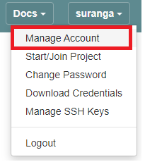

Now you need to select or create an experiment profile. For FPGA experiments, we have created the profile ```oct-u280``` which can be used to boot up either an Ubuntu or CentOS image and install run-time tools automatically by running a post-boot script in the background. It is also possible to create your own profiles. To learn how to do this, please refer to [The Cloudlab Manual](http://docs.cloudlab.us/).

Select Experiments &#8594; Start Experiment.


Click Change Profile and select the profile ```oct-u280```.

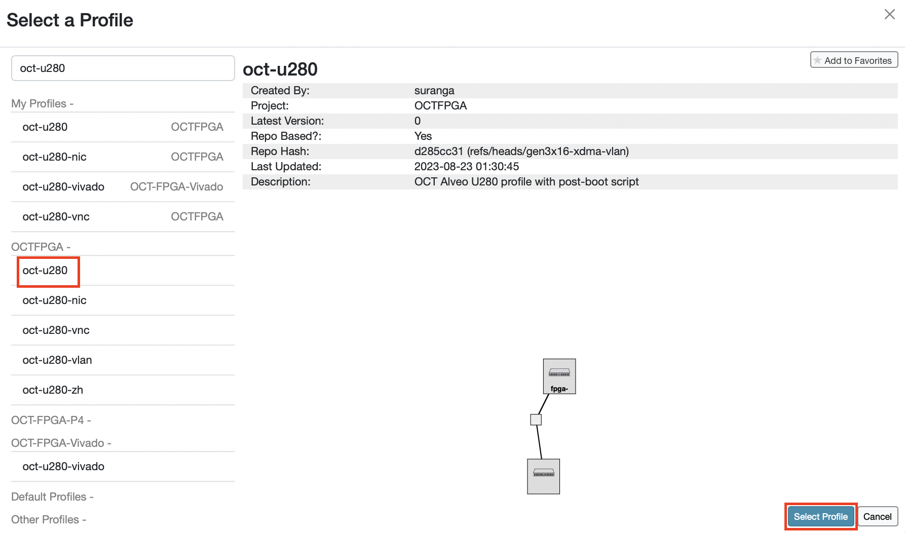

Click Next.

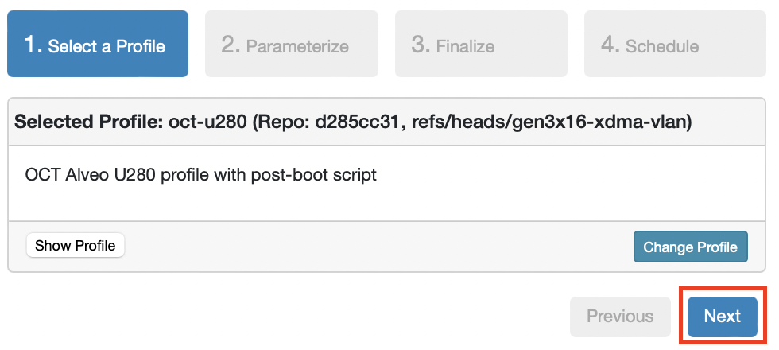

You can customize the experiment by parameterizing the setup. Enter the name of the required node, a tool version, and the OS from the list of options. For workflow, choose Vitis if you plan to use the Vitis application acceleration workflow. If you plan to use the traditional flow, choose Vivado.

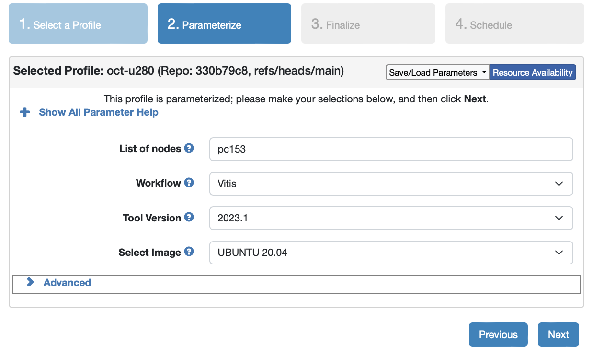

Optionally, enter a name for the experiment and click Next.

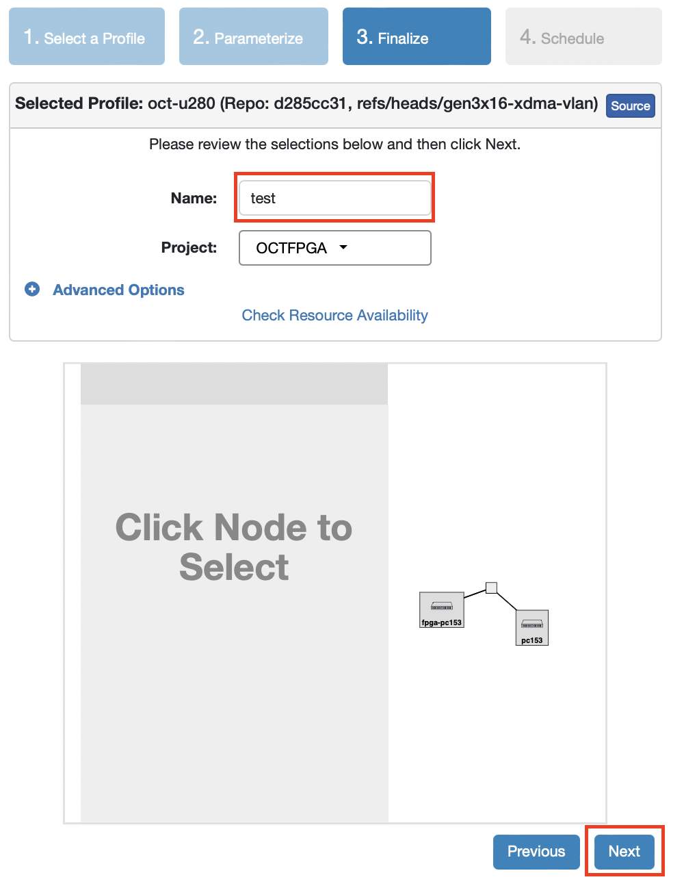

You can set the experiment duration now, or click Finish.

It is important to keep in mind that after 16 hours, everything you have done in this experiment will be wiped out from your node. Therefore, ensure that you complete the experiment by then and save the experiment outputs in a persistent storage.

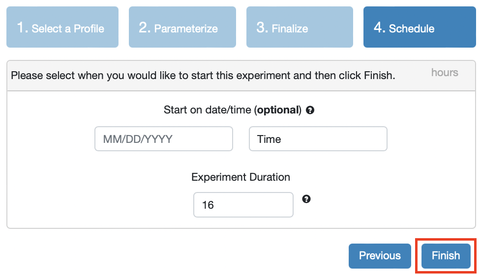

Now, CloudLab will start provisioning cloud resources based on the parameters you specified.

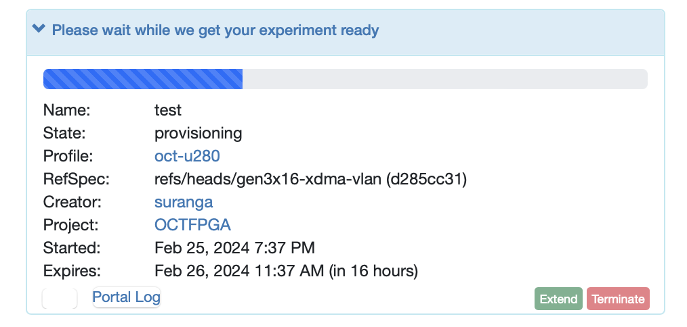

The node will start to boot up.

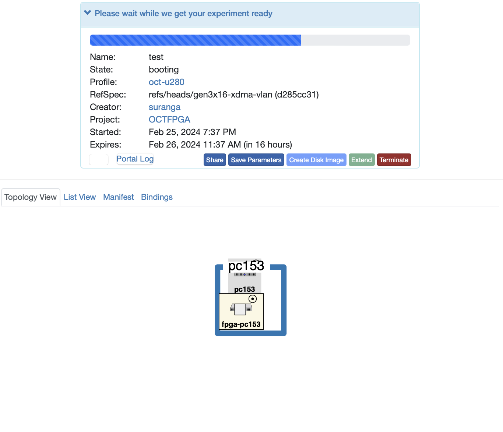

After boot up, the node will run the startup script which will download and install run time tools required to communicate with the FPGA. The node icon will show that the startup script is ```Running```.

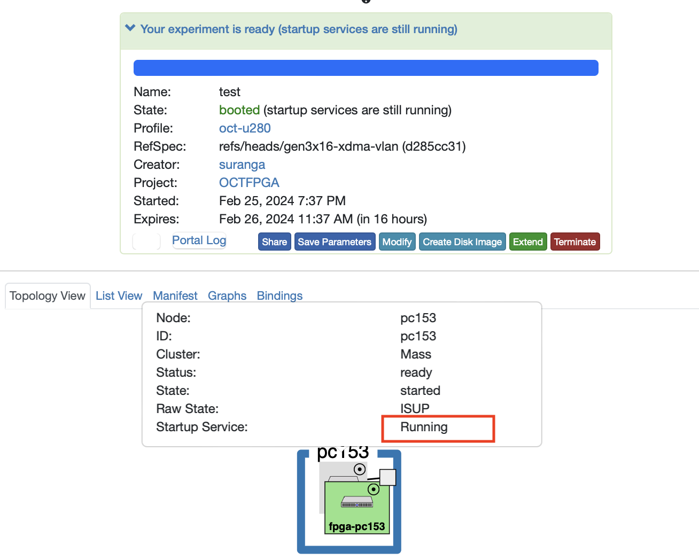

After running the script, the icon status will change to ```Finished```. Your experiment is ready now.

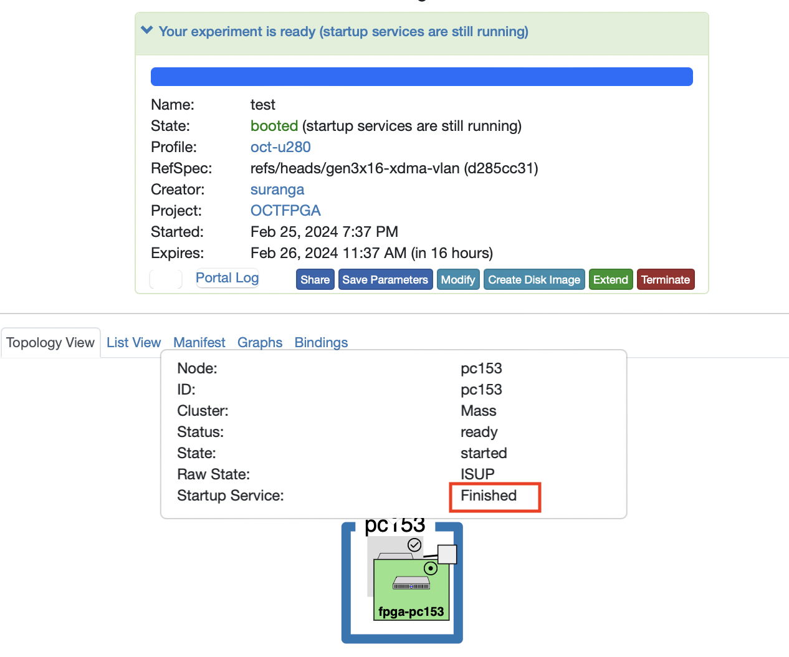

Switch to the tab List View. Now you will see the SSH command that you can use to conect to this server. Use any SSH client to connect to the node. Alternatively you can select the Shell option in the UI which will open a shell.

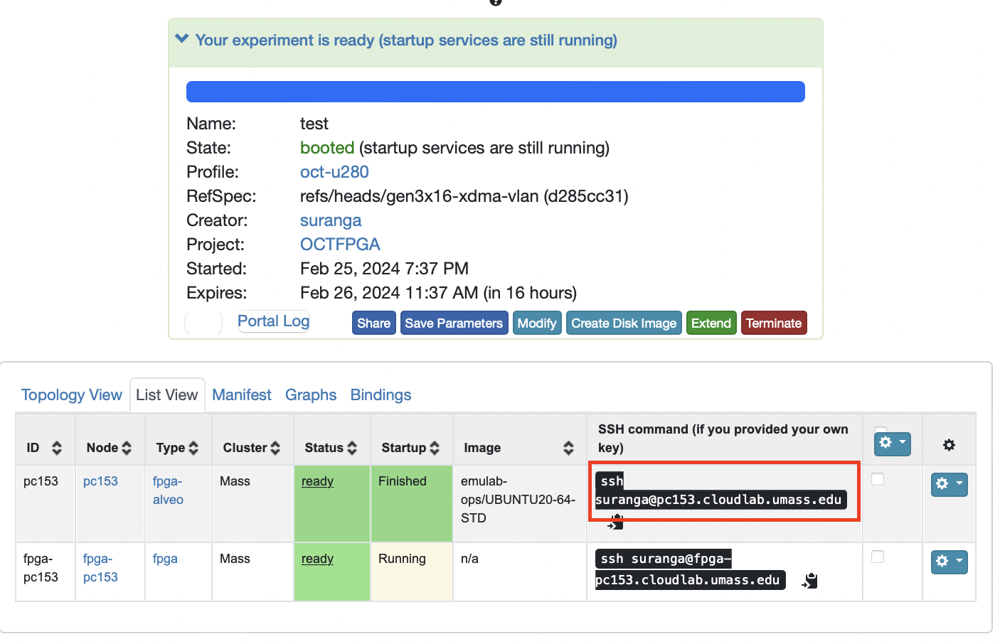

Your experiment is ready now.

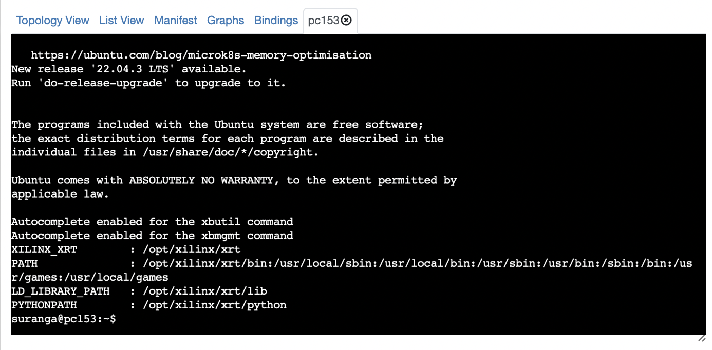


## Useful links

[The CloudLab Manual](http://docs.cloudlab.us/)
