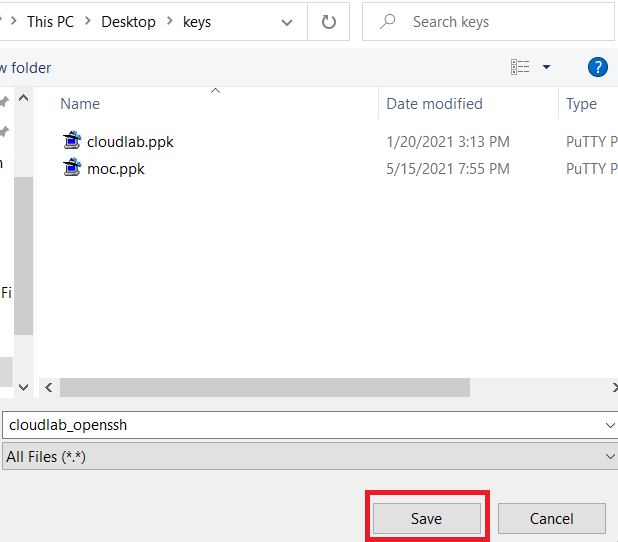

# PuTTY .ppk to OpenSSH Conversion

## Tools
PuTTYGen

## Steps

Open PuTTYGen and load the existing private key (.ppk).

Click Conversions &#8594; Export OpenSSH key.

Select a file name (file extension not required) and a location, and click Save.

