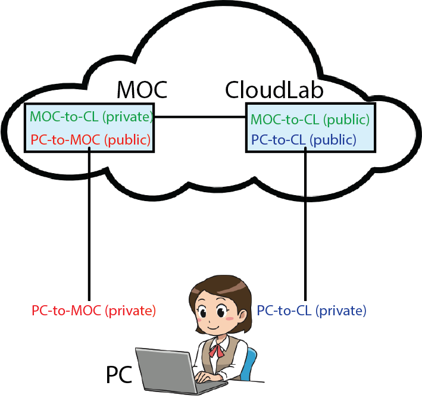
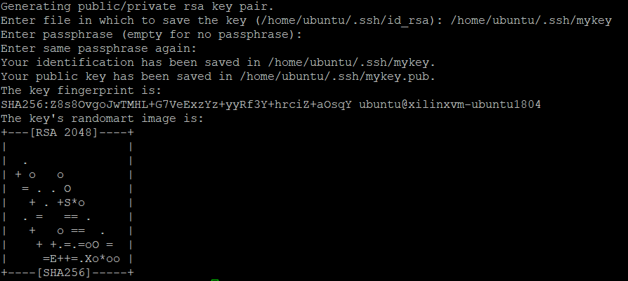

# Create SSH Keys for Remote Access

In OCT there are three entities that need to be configured for SSH access.

- Your home/work computer
- The MOC VM
- The CloudLab node

For a typical application, you need to deploy your public/private keys as shown in this figure.



It is conveneient if you generate the SSH key-pair on the client-side node and copy the public key over to the server that you plan to connect to. For example, if you want to access a CloudLab node from an MOC VM, you may generate the key-pair in MOC and copy the public key over to CloudLab. In MOC workflow, you can [generate a key-pair using the OpenStack web interface](https://github.com/OCT-FPGA/oct-tutorials/blob/main/mocsetup/account-setup-and-configuration.md#3-create-an-ssh-key-pair) and download the private key to your home/work computer. However, to access a CloudLab node, you need to create a key-pair manually using an SSH key generator.     

## Steps

Open a terminal and enter the following command.

```bash
$ssh-keygen
``` 

Enter a name and location for the SSH key that you will create. Optionally enter a key passphrase for added security.



You will have two keys; a public key and a private key. The public key ends with the extension .pub. If you want to access a CloudLab node, [this key needs to be copied when you set up your CloudLab experiment](https://github.com/OCT-FPGA/oct-tutorials/tree/main/cloudlab-setup#12-existing-users).  
