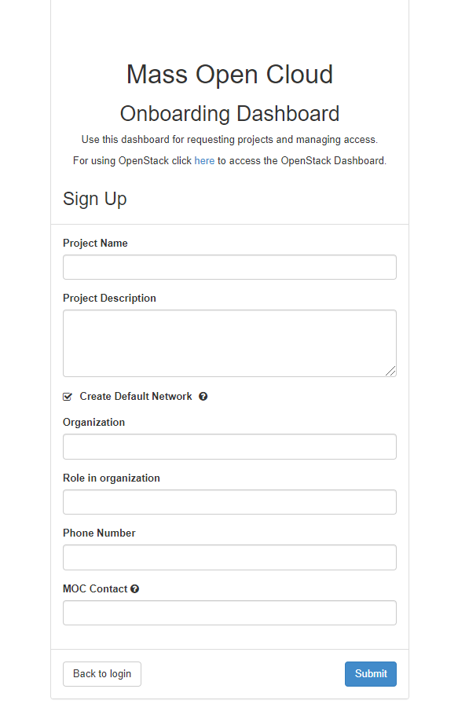
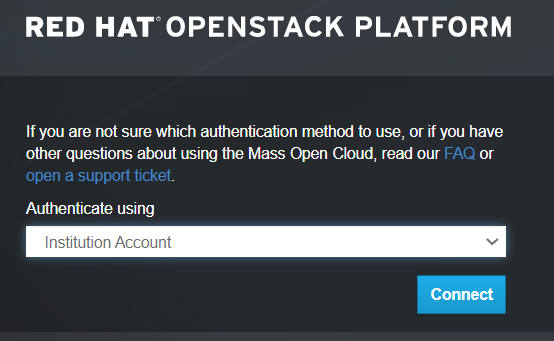
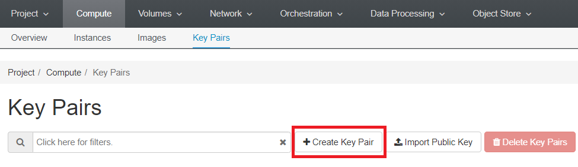
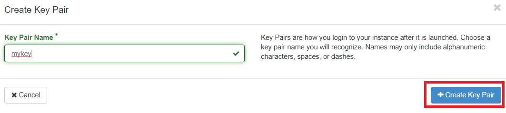
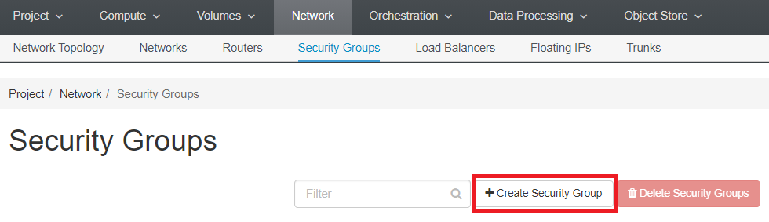
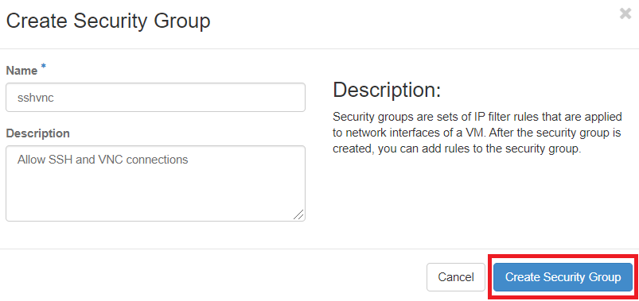
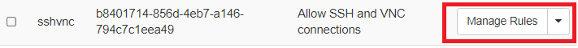
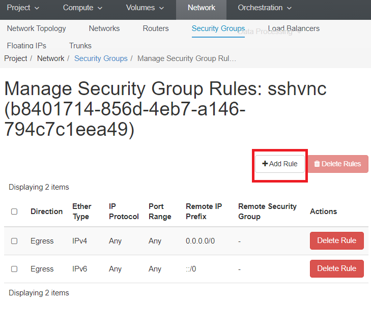
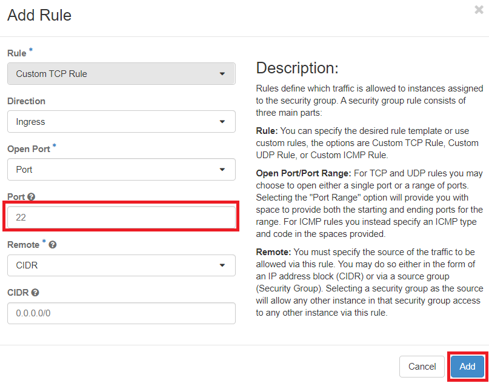
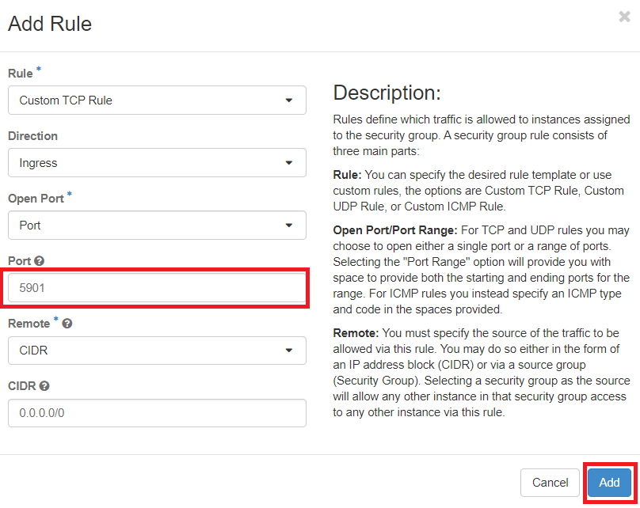

# Creating an MOC Account and Basic Configurations

Follow these instructions to set up an account on Mass Open Cloud (MOC), set up key pairs, and configure ports for VNC and SSH access. These configurations are required for the virtual machine (VM) that you will create to do experiments with Xilinx tools. If you have already completed these steps, you may follow [these instructions](https://github.com/OCT-FPGA/OCT-Tutorials/blob/master/mocsetup/instancesetup.md) to set up the VM.  

## 1. Create an account

If you already have an MOC account, skip to [Section 2](https://github.com/OCT-FPGA/OCT-Tutorials/blob/master/mocsetup/account-setup-and-configuration.md#2-log-in).

To create an account, go to [massopen.cloud](https://massopen.cloud) and click USER RESOURCES &#8594; REQUEST A PROJECT. Enter your university login credentials. Then you will have to complete a form by entering the details about your project.

MOC contact: Suranga Handagala. Fill out and submit the form. 

Once your request got the approval (typically this will take up to two business days) you will be able to create your own virtual machine (VM) and start using Vitis tools. 

Go to step 2 once you got the approval.

## 2. Log in 

Go to [kaizen.massopen.cloud](https://kaizen.massopen.cloud), select Authenticate using Institutional Account, and click Connect. 

Enter your credentials (e.g. first.lastname@northeastern.edu or username@bu.edu) and log in to the massopen.cloud dashboard. 

## 3. Create an SSH key pair

You need to create an SSH key-pair to be able to log in to the VM that you will create. To do this, go to Compute &#8594; Key Pairs and click Create Key Pair. 

Then enter a key pair name and click Create Key Pair. A private key will be automatically downloaded to your computer. Keep the downloaded key in a safe place. You will need it later to log in to the VM.

## 4. Create a security group

Go to Network &#8594; Security Groups and click Create Security Group.

Create a security group to allow SSH and VNC connections to the VM you create.

Then click Manage Rules in the security group you just created.

Click Add Rule.

Add a rule to allow SSH connections from port 22.

Similarly, add a rule to allow VNC connections. Enter your preferred VNC port number here. VNC port numbers start from 5900. Skip this step if you do not want to connect through VNC.  

