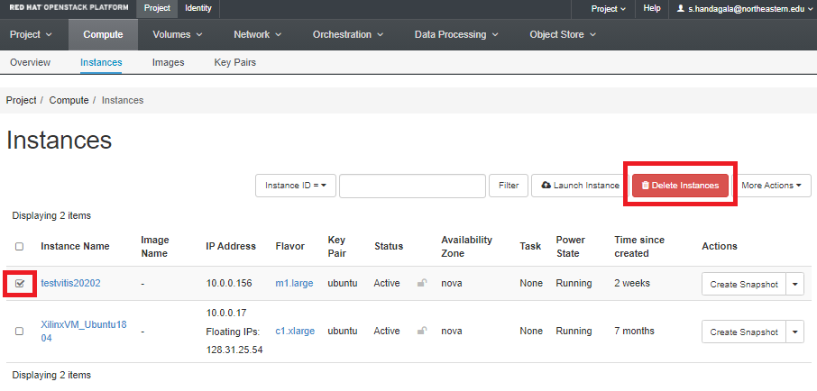
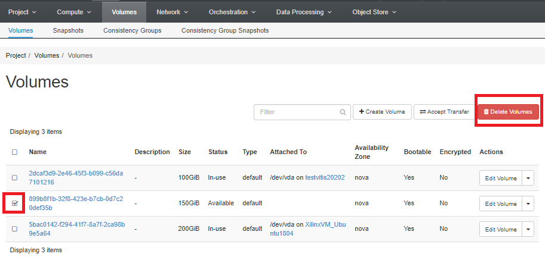

## Deleting an MOC VM

If you no longer need a VM, you can delete it. Make sure you back up any important files from the instance before you delete because this action can't be undone.

To delete an instance, go to Compute &#8594; Instances and select the instance you want to delete. Then click Delete Instances.

Note that the volume attached to this instance may or may not get deleted depending on how you configured it at the time of instantiation. If the volume did not get deleted, you have to delete it manually. 

Go to Volumes &#8594; Volumes, and select the volume that you want to delete. Note that the corresponding "Attached To" field should be empty now because the volume that you are going to delete is not attached to any instance now. Click Delete Volumes.

