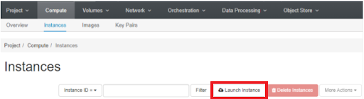

# Creating an MOC Virtual Machine (VM) Instance

This tutorial includes instructions on how to create a virtual machine (VM) on MOC which includes pre-installed Xilinx Vitis tools to build accelerator applications for Alveo data center cards.

## Prerequisites

You are expected to have followed [these instructions](https://github.com/OCT-FPGA/OCT-Tutorials/blob/master/mocsetup/account-setup-and-configuration.md) before getting started.

## Steps

Log into [kaizen.massopen.cloud](https://kaizen.massopen.cloud).

Go to Compute &#8594; Instances tab and click Launch Instance. 



Enter a name for the instance and optionally a description. Then click Next.


Select boot source as Image and pick a Vitis images from the available list of images (click the up arrow to select). The images available at the moment are: 

```bash
vitis-2020.1-ubuntu-18.04
vitis-2020.2-ubuntu-18.04
```
Click Next.

<!------>

Then you need to specify a flavor for the VM. It is recommended to have at least 64 GB of RAM to run the tool. Select a matching flavor (e.g. c1.xlarge).
Then select the security group you previously created.


Then select the keypair you previously created and click Launch Instance.


Once your VM started, click Associate Floating IP.


Then select the IP address you want to associate and click Associate.


Note: If you do not see an IP to associate, you first need to get a floating IP from the external pool of IPs. To do this goto Network &#8594; Floating IPs,


and allocate an IP from the pool.


Your VM can now be accessed over the internet using any SSH client like PuTTY. The user name is ubuntu.

You can also set up a VNC server and a client for GUI access. These instructions can be found [here](https://github.com/OCT-FPGA/OCT-Tutorials/blob/main/vncsshsetup/README.md
). 
