# NERC VM User Guide

*If you don't already have a user account on the VM, please send an email to s.handagala@northeastern.edu by including 1. your full name, 2. preferred username, 3. SSH public key, 4. your advisor's name, 5. a brief description of the project.*

This guide walks you through the steps for connecting to a virtual machine (VM) on New England Research Cloud (NERC) that will allow you to build FPGA bitstreams and host applications that run on Alveo U280s in CloudLab. We call this VM the **build server**. This server is not connected to the public internet. The only way for FPGA users to access the build server is via a **bastion host** which has a public IP address.

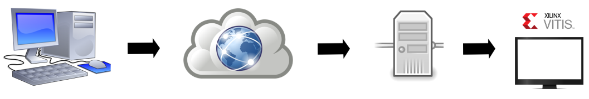

## Steps

### For Windows Users

1. Download and install MobaXterm on your home computer. You may choose to install either the portable edition or home edition. 

2. Open [MobaXterm](https://mobaxterm.mobatek.net/download-home-edition.html). Right click **User sessions** and select **New session**.
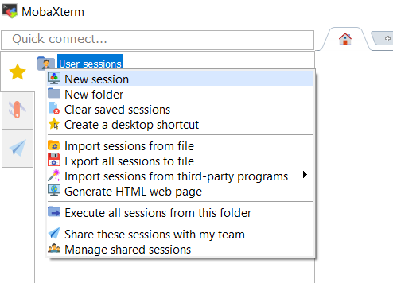

3. Click the SSH icon in Session settings. Enter the IP address and your user name for the build server. Under **Advanced SSH settings**, select your private key to access the server. 
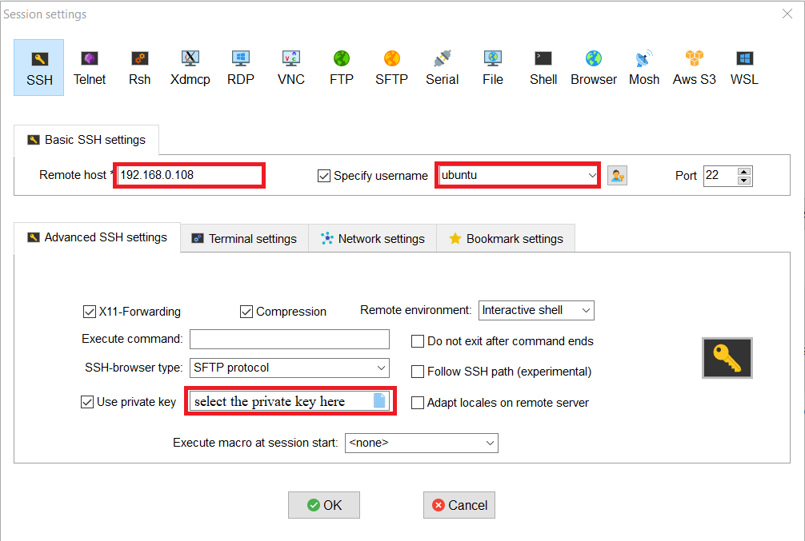

4. From the **Network settings**, select **SSH gateway (jump host)**. This is where you enter the information of the bastion host. 
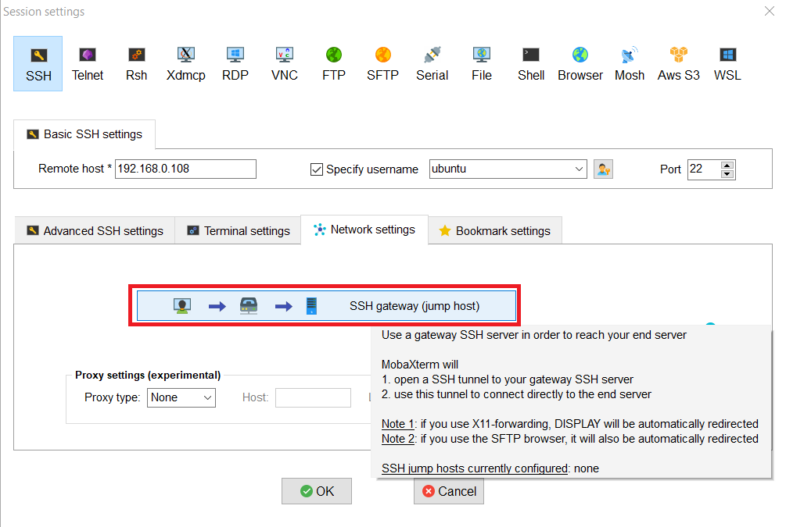
The IP address of the bastion host is 199.94.60.18. Enter your user name, select the private key (the same key that was used in step 3) and click OK. 
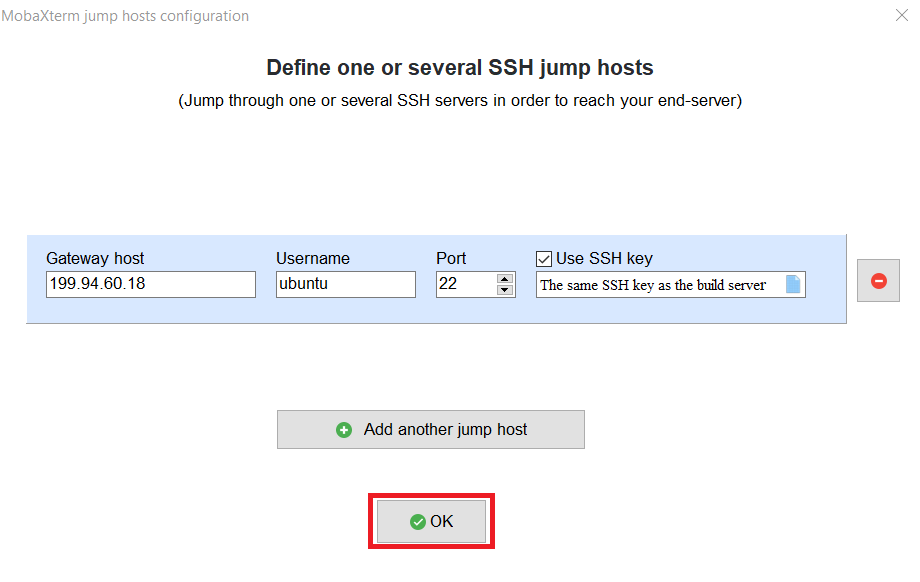

5. Click **OK** on the main session window. 
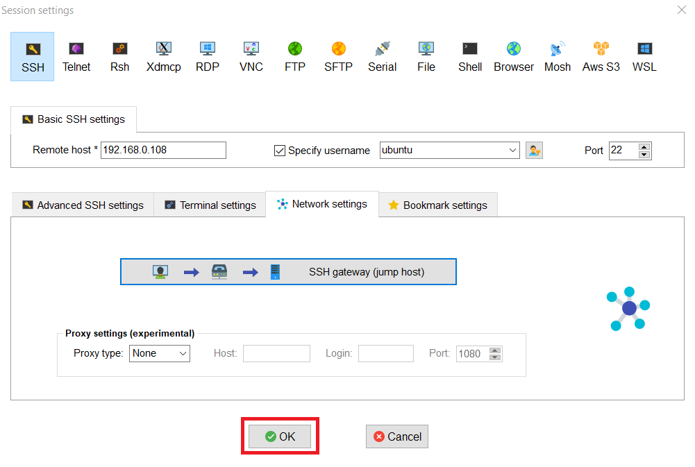
Your SSH session will automatically open now. 

<!-- 6. You may now create a VNC server instance on the VM. Run the command ````vncserver````.
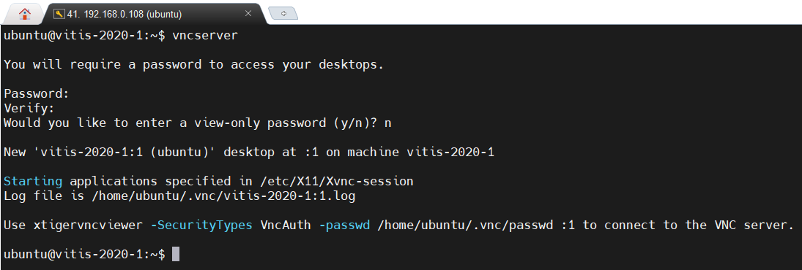

7. Now create a VNC startup configuration file named xstartup in ````<your home directory>/.vnc/````. Run the following command
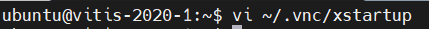
and paste the following on the file.

````bash
#!/bin/sh
# Start Gnome 3 Desktop 
[ -x /etc/vnc/xstartup ] && exec /etc/vnc/xstartup
[ -r $HOME/.Xresources ] && xrdb $HOME/.Xresources
vncconfig -iconic &
dbus-launch --exit-with-session gnome-session &
````

Save the file and exit the text editor.

8. Kill the vncserver instance that you just created by running ````vncserver -kill :<vnc port number>````.
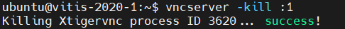-->

6. Start a new VNC server instance with your preferred port number and screen resolution.
Example: Create a VNC server instance with a resolution of 1920x1080 and port number 5905: ````vncserver -localhost no -geometry 1920x1080 :5````
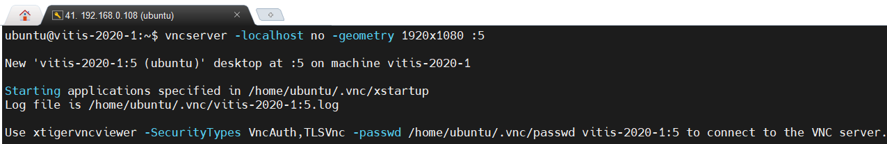
This will create a VNC server instance listening on port 5905.

7. Now, right click the session that you just created and click **Edit session**.
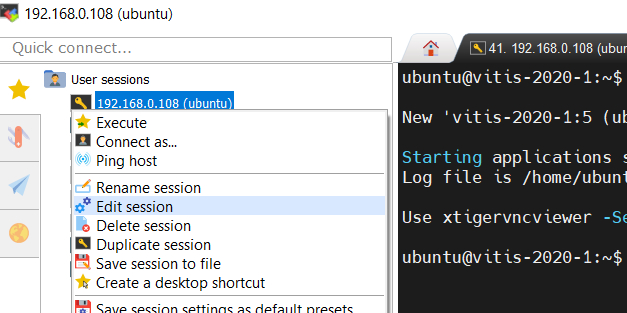

8. Enter the VNC session information and click **OK**.
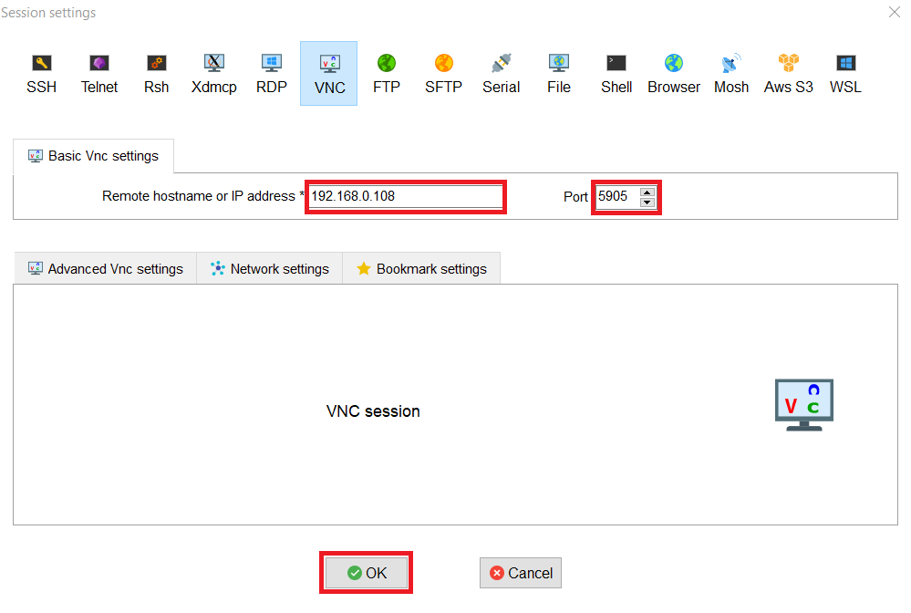

9. Double click the session (Notice that the icon of your session has changed. You will now be able to access the graphical desktop of the build server as shown below.
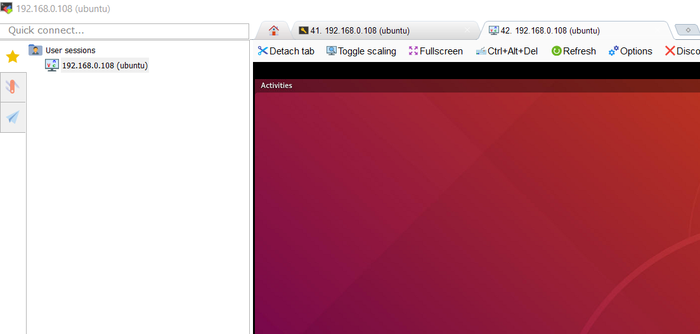
The setup is complete now. Xilinx tools can be found in ````/tools/Xilinx````.

Useful commands:

If you want to use command line, the following command can be used to connect to the build server.

````ssh -o ProxyCommand="ssh -i <private key> -W %h:%p username@bastion_host" -i <private key> username@build_server````

Use the following command to copy files to the build server.

````scp -o "ProxyCommand ssh -i <private key> username@bastion_host nc %h %p" -i <private key> -r <directory to be copied> username@build_server:<destination directory>````

### For MAC Users

1. Set up SSH access to the builder server by using the following command in terminal.

````ssh -o ProxyCommand="ssh -i <private key> -W %h:%p username@bastion_host" -i <private key> username@build_server````

2. Repeat the steps 6-9 shown above (i.e., the steps for Window Users) to set up a VNC server instance.

3. Exit the SSH access by running the following command in terminal:

````exit````

4. Since in the above example we create a VNC server instance with port number 5905, use the following command in terminal to connect to the VNC server via SSH local port forwarding. Here we note that you should always run this command before opening any VNC Viewer and exit this command after closing the VNC Viewer.

````ssh -L 5905:localhost:5905 -o ProxyCommand="ssh -i <private key> -W %h:%p username@bastion_host" -i <private key> username@build_server````

5. Download and install any VNC Viewer on your PC. In this tutorial we use RealVNC for demonstration, which can be downloaded from https://www.realvnc.com/en/connect/download/viewer/

Open the VNC Viewer, and goto File &#8594; New connection... to create a new connection.
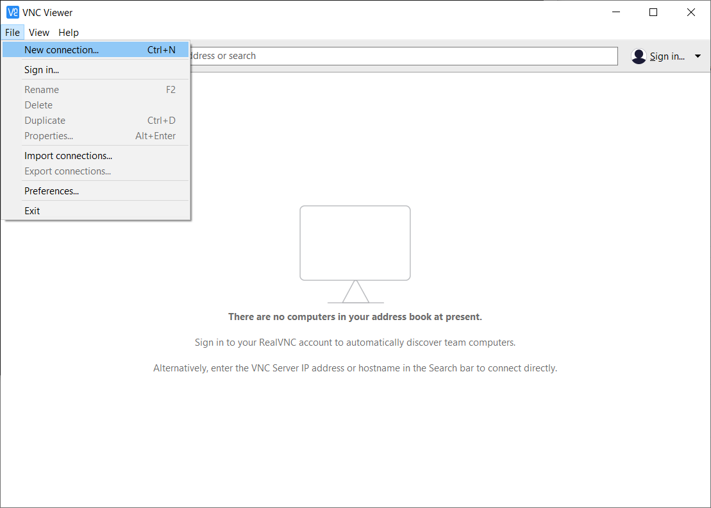

Enter localhost:VNC port number (5905 in our case) as the VNC server name, and click **OK**.
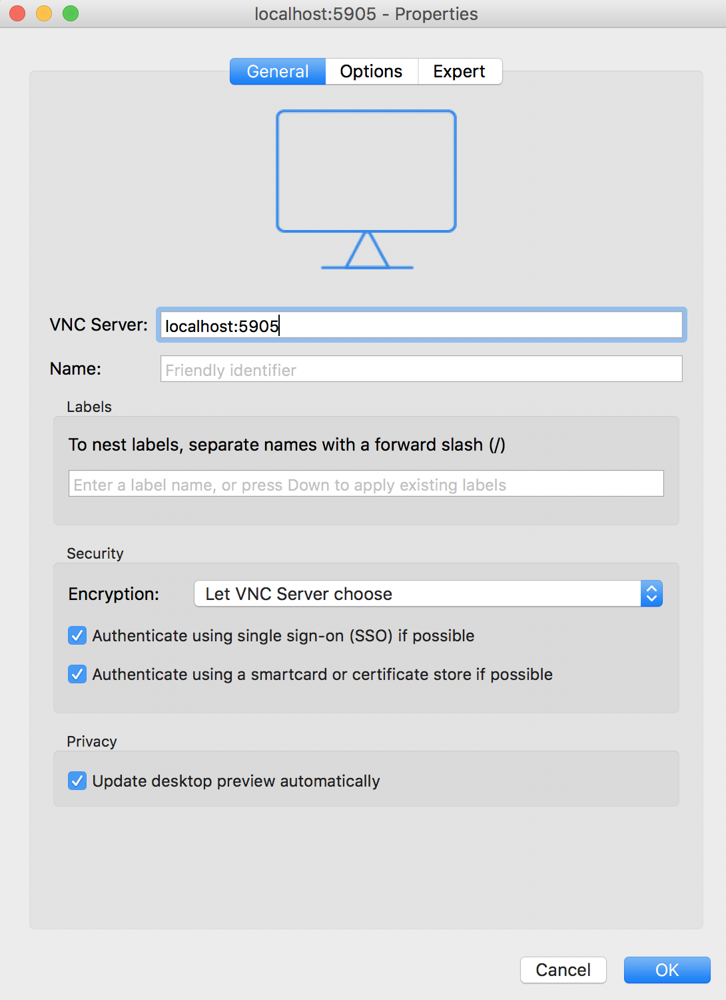

Now, you should see an icon on the VNC viewer window which you double click and enter the password that you created in step 6 (the step for Windows Users). Select the checkbox "Rembember password" so that you won't have to enter it next time.
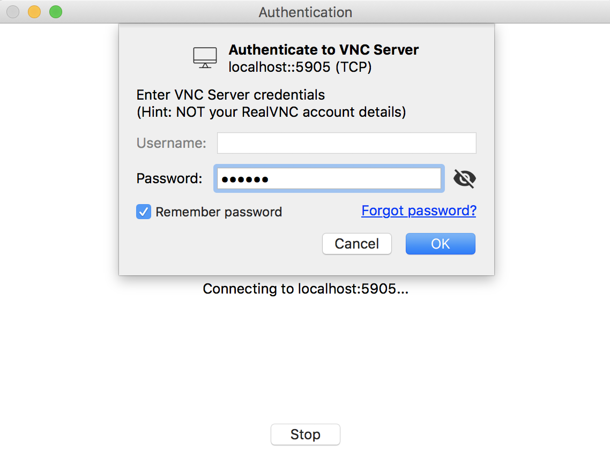

You should be able to see the VNC desktop now.
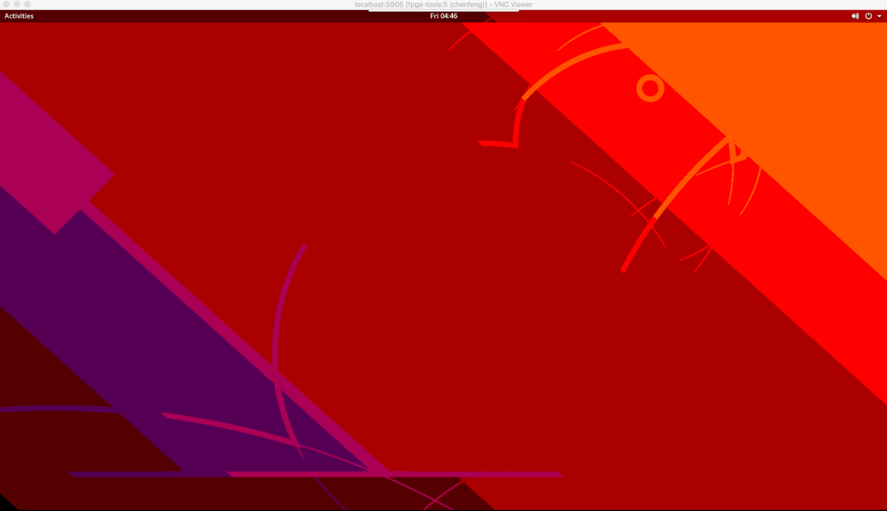
