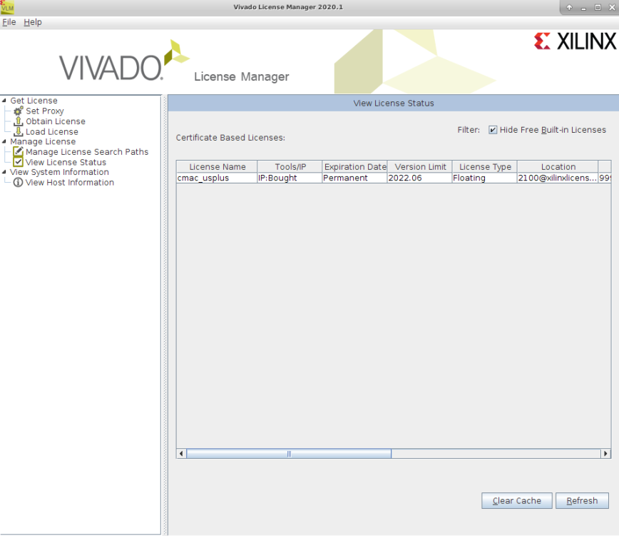

# How to Check Out Xilinx Floating License for CMAC

Before you start to build the bitstream, run the following command.

```bash
export XILINXD_LICENSE_FILE=2100@xilinxlm
```
To verify that the license is checked out, run ```vlm``` and see if the CMAC license is present.



If you see the license ```cmac_usplus```, you can close Vivado license manager and proceed to build the bitstream.

