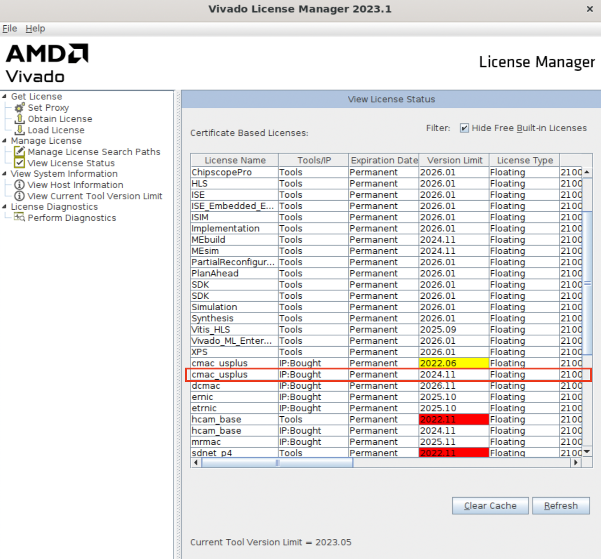

# How to Check Out Xilinx Floating License for CMAC

Run the following command before starting the build process.

```bash
export XILINXD_LICENSE_FILE=2100@octlm
```
To verify that the license is checked out, run ```vlm```and check if the CMAC license is present.



When the `cmac_usplus` license appears, close the Vivado License Manager and proceed to build the project.
