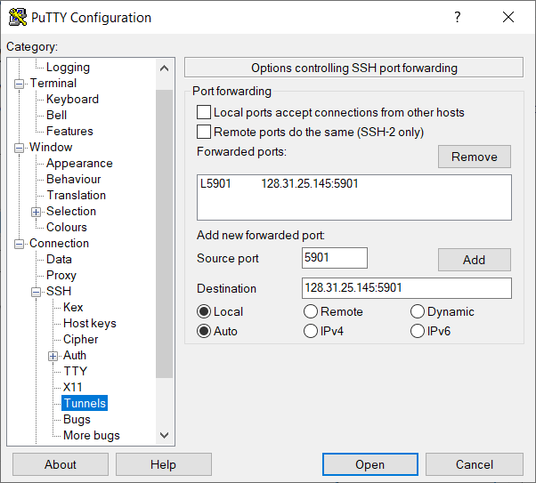

# SSH and VNC Access for MOC (for Windows Users)

Before you start, make sure that you have booted up an MOC compute instance (VM) according to the instructions given in [this tutorial](https://github.com/OCT-FPGA/OCT-Tutorials/blob/main/mocsetup/instancesetup.md). Follow these instructions to get access to the GUI of this instance.

## Tools

- PuTTY (https://www.putty.org/)

- PuTTYgen

- Any VNC viewer

Note: PuTTYGen is automatically installed with PuTTY. 

## 1. Set up SSH access

### 1.1 Set up the private key

Install PuTTY if you haven't already done so. By now, you should have the private key generated in step 3 of [this tutorial](https://github.com/OCT-FPGA/OCT-Tutorials/blob/main/mocsetup/account-setup-and-configuration.md).  Now, launch PuTTYgen and click Conversions &#8594; Import key, and select the private key that you have. This key should be a .pem file. 


Then click "Save private key"


Save the key with any name you want, but the extension should be .ppk.


### 1.2 Set up PuTTY
Launch PuTTY, goto Connection &#8594; SSH &#8594; Auth, and select the private key (.ppk) that you created in step 1.1. 


Then you'll need to set up VNC port forwarding in PuTTY. To do this, goto Connection &#8594; SSH &#8594; Tunnels, and enter the VNC port number and IP address in Source port and Destination text boxes as shown in the following figure. The port number should be as same as that you entered when creating the VM (eg: 5901). Then click Add.



Goto Session, enter the host name as ```ubuntu@<your IP>```. Make sure the Port is 22 and Connection type is SSH. Enter a name for the session and click Save. Now, even if you exit and restart PuTTY, you should be able to retrieve these connection settings if you select the saved session and click Load.   


After you select the session, click Open to log in to the MOC VM through SSH.

## 2. Set up VNC

### 2.1 Set up VNC server on the MOC instance

On the window that opens up after successfully authenticating to MOC, create a VNC server instance by entering the following command.

```bash
vncserver
```

For first time users, a password is required.


Open the VNC startup configuration file located in ```~/.vnc/xstartup```.

```bash
vi ~/.vnc/xstartup
```
Replace the content of the file with the following. If you want to know what these commands to, refer to [this tutorial](https://www.digitalocean.com/community/tutorials/how-to-install-and-configure-vnc-on-ubuntu-18-04).

```bash
#!/bin/bash
xrdb $HOME/.Xresources
startxfce4 &
```
Save this file and exit. Then kill the VNC server.

```bash
vncserver -kill :1
```
Now you need to restart the VNC server. This time, you may specify the preferred resolution and port number. The port number that you enter here should be ```VNC port number (minus) 5900```. As an example, the following command will create a VNC server on port 5901 with screen resolution 1920x1080.

```bash
vncserver -geometry 1920x1080 :1
```

Now, log out from your PuTTY session, and log back in. You can simply close and re-open the PuTTY session to do this.

### 2.2 Set up VNC client on your PC

Download and install any VNC Viewer on your PC. In this tutorial we use RealVNC for demonstration, which can be downloaded from https://www.realvnc.com/en/connect/download/viewer/. 

Open the VNC Viewer, and goto File &#8594; New connection... to create a new connection.


Enter localhost:VNC port number (5901 in our case) as the VNC server name, and click OK.


Now, you should see an icon on the VNC viewer window which you double click and enter the password that you created in step 2.1. Select the checkbox "Rembember password" so that you won't have to enter it next time.


You should be able to see the VNC desktop now. Click "Use default config" in the dialog box. You are now ready to use your MOC VM with GUI access.


This concludes the tutorial.
